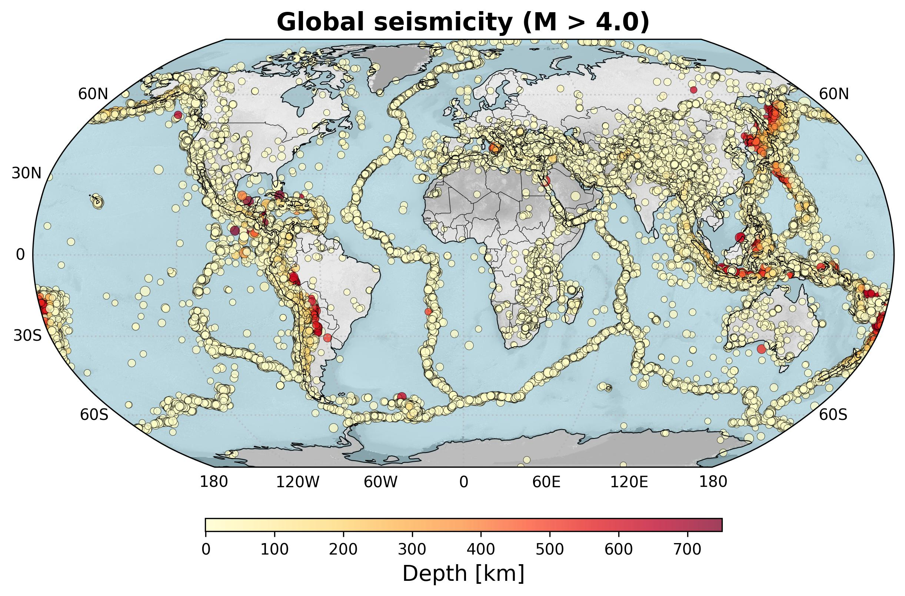
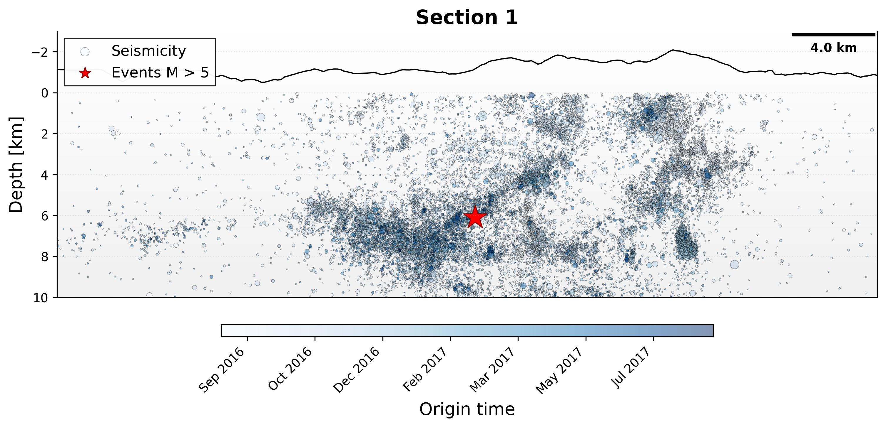
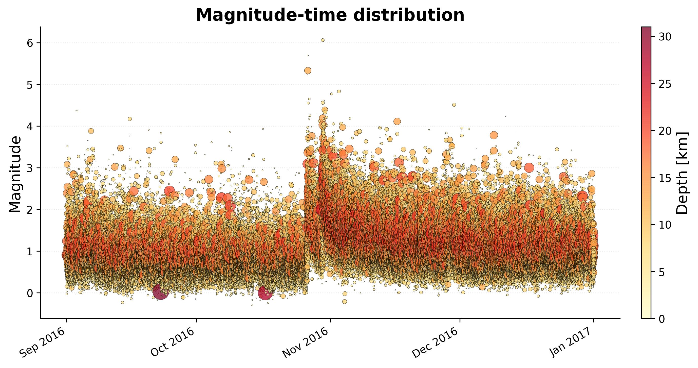
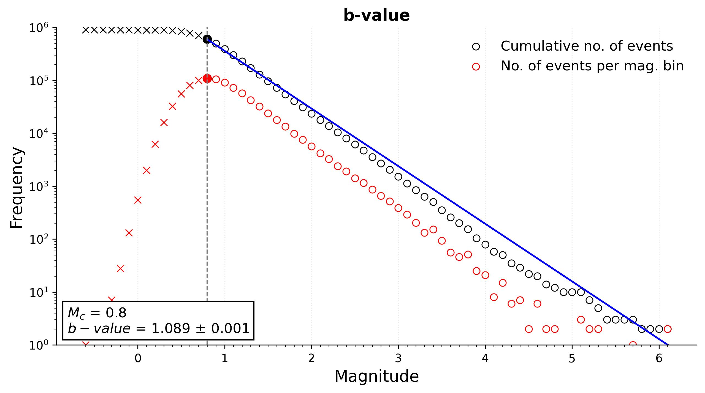
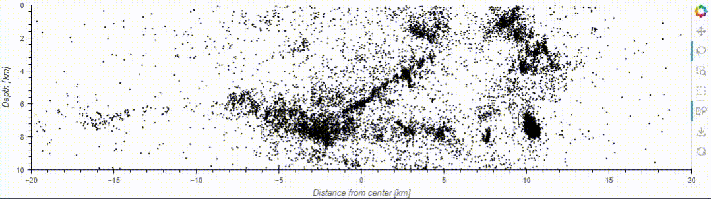

<p align="center">
  <strong>
    <a href="https://seismoviz.readthedocs.io/en/latest/index.html">Documentation</a>
  </strong>
</p>

SeismoViz is open-source Python library designed to simplify the analysis, manipulation, and visualization of seismic catalogs. With its intuitive and efficient interface, it reduces complex workflows into just a few lines of code, empowering users to explore seismic data effortlessly.

## 🚀 Getting started

### Catalog refinement
Easily clean and organize your seismic catalog. With SeismoViz, you can remove duplicates, filter data based on your needs, and sort events with just a few simple commands.

```python
import pandas as pd
import seismoviz as sv

# Read the catalog from a file
catalog = sv.read_catalog(source='global_seismic_catalog.csv')

# Remove duplicates
catalog.deduplicate_events()

# Apply filters
fc = catalog.filter(
    mag=('greater', 4),
    depth=('between', [50, 100]),
    time=('lower', '2019-12-28')
)

# Apply sorting
fc.sort(by='time', ascending=True)

# Save the refined catalog
fc.data.to_csv('global_seismic_catalog_filtered.csv', index=False)
```

### Advanced visualization
SeismoViz provides tools to quickly create clear and publication-ready visualizations of seismic data. From plotting earthquake distributions on a map to generating cross-sections, you can easily represent your catalog in a variety of ways.

```python
import seismoviz as sv

# Read the catalog from a file
catalog = sv.read_catalog(path='global_seismic_catalog.csv')

# Create a map showing earthquake locations
catalog.plot_map(
    title='Global seismicity (M > 4.0)',
    color_by='depth',
    cmap='YlOrRd',
    size='mag',
    projection=ccrs.Robinson()
)
```



```python
import seismoviz as sv

# Read the catalog from a file
catalog = sv.read_catalog(path='local_seismic_catalog.csv')

# Create cross section object
cs = sv.create_cross_section(
    catalog=catalog,        
    center=(13.12, 42.83),  
    num_sections=(0,0),     
    thickness=2,            
    strike=155,             
    map_length=40,          
    depth_range=(0, 10)     
)

# Visualize the cross-section
cs.plot_sections(
    color_by='time',        
    cmap='Blues',           
    size='mag',             
    edgecolor='black',
    legend='Seismicity',
    legend_loc='upper left',
    scale_legend_loc='upper right'  
)     
```


### Statistical analysis
SeismoViz simplifies seismic data analysis with built-in tools for exploring catalog distributions, plotting event timelines, and calculating the b-value directly from your catalog. These features enable quick and straightforward statistical analysis of your seismic data.

```python
import seismoviz as sv

# Read the catalog from a file
catalog = sv.read_catalog(path='local_seismic_catalog.csv')

# Plot magnitude-time distribution
catalog.magnitude_time(
    color_by='depth',
    size='depth',
    cmap='YlOrRd',
)
```


```python
import seismoviz as sv

# Read the catalog from a file
catalog = sv.read_catalog(path='local_seismic_catalog.csv')

# Estimate b-value and plot it
catalog.b_value(
    bin_size=0.1,
    mc='maxc'
)
```


### Interactive selections
SeismoViz allows you to interactively explore your seismic catalog, enabling you to visually select subsets of data directly from your plots.

```python
import seismoviz as sv

# Initialize selector object to open the interactive GUI
selector = sv.select(instance=cs)
```


```python
# After selecting the events, confirm the selection
selection = selector.confirm_selection()
```

These are just a few examples of what you can do with SeismoViz. There's so much more to explore! Check out the [documentation](https://seismoviz.readthedocs.io/en/latest/index.html) to discover all its features and capabilities.

## 🤝 Contributing

Contributions are welcome! If you'd like to contribute, please follow these steps:

1. Fork the repository.
2. Create a new branch (`git checkout -b feature-branch`).
3. Make your changes.
4. Commit your changes (`git commit -m 'Add some feature'`).
5. Push to the branch (`git push origin feature-branch`).
6. Open a pull request.

**NOTE:** Make sure your code contributions follow the Python PEP8 Style Guide standards.

## 📜 License

This project is licensed under the MIT License. See the [LICENSE](LICENSE) file for details.

## 📧 Contacts

Author: Gabriele Paoletti  
E-mail: gabriele.paoletti@uniroma1.it

Feel free to reach out if you have any questions or suggestions!
