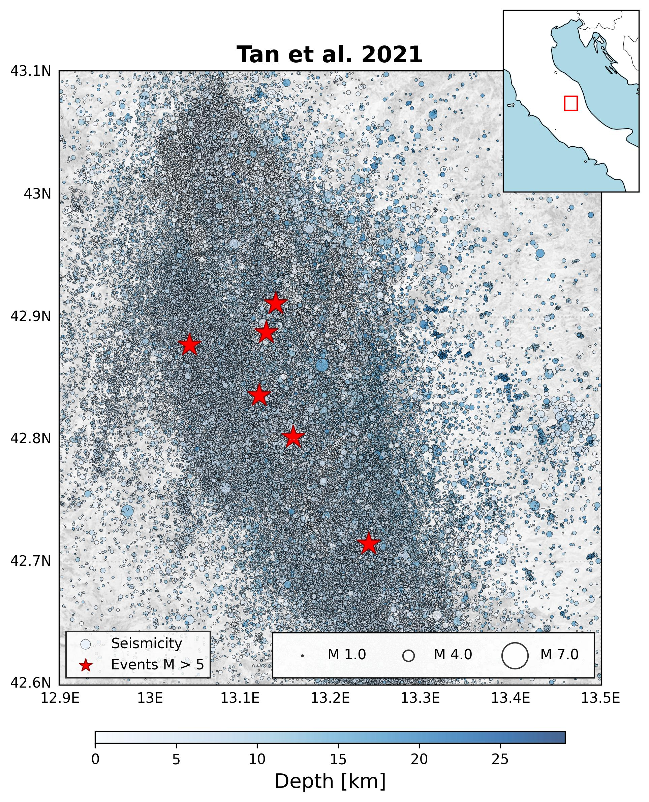
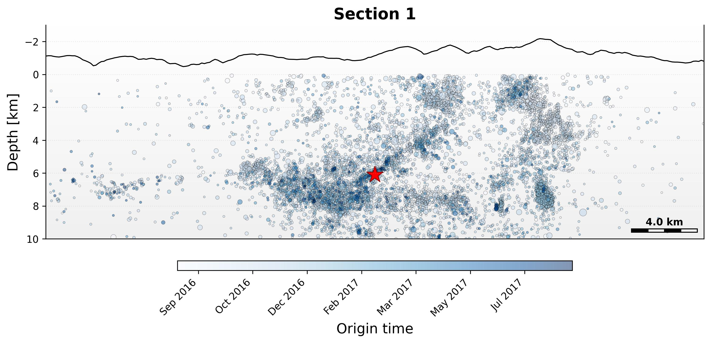

# SeismoViz

An open-source, user-friendly Python library for streamlined analysis, manipulation and visualization of seismic catalogs.

Through a clean and efficient interface, it reduces complex analysis workflows to just a few lines of code. Users can create publication-ready visualizations, perform spatial and temporal analysis, and handle large seismic datasets with minimal effort.

## ✨ Features

- 🎯 **Smart filtering:** Easily filter seismic events by magnitude, time, location, and depth with intuitive methods.
- 🗺️ **Visualization:** Create publication-ready maps, cross-sections and plots with just a few lines of code.
- 📊 **Statistical tools:** Analyze seismic sequences, calculate magnitude distributions, and perform more complex statistical analyses.
- 🔍 **Interactive selection:** Subset events by drawing polygons directly on maps or cross-section for detailed analysis.

## 📋 Documentation

For a comprehensive guide on how to install, configure, and use this library, please refer to the SeismoViz official documentation. It provides detailed instructions on setting up the library, as well as examples and best practices to help you get the most out of your experience.

## 🚀 Getting started
Here's a quick overview of SeismoViz's core functionalities. These examples demonstrate how to load, filter, and visualize seismic data in just a few lines of code.

### Loading data
Load your seismic catalog with a single line of code. SeismoViz automatically handles various input formats:

```python
import seismoviz as sv

# Load the catalog
ct = sv.read_catalog('tan_catalog.csv')
```

### Filtering events
Apply multiple filtering criteria to extract your subset of interest. The flexible filtering syntax allows for intuitive data selection:

```python
fc = catalog.filter(
    mag=('greater', 1,              # Magnitude > 1
    lon=('between', [12.9, 13.5]),  # Longitude range
    lat=('between', [42.6, 43.1])   # Latitude range
)
```

### Creating maps
Generate publication-ready maps with customizable parameters. Visualize your events based on multiple attributes:

```python
fc.plot_map(
    title='Tan et al. 2021', # Set the title of the map
    hl_ms=5,                 # Highlight events with magnitude > 5
    color_by='depth',        # Color events by depth
    cmap='Blues',            # Choose colormap
    size='mag',              # Size proportional to magnitude
    legend='Seismicity'      # Custom legend label
)
```
<p align="center">
  
  <br>
  <em>Seismic events distribution colored by depth with size proportional to magnitude.</em>
</p>

### Create a cross-section
Create detailed cross-sections to analyze the spatial distribution of seismicity at depth:

```python
cs = sv.create_cross_section(
    catalog=fc,             # Select the source catalog
    center=(13.12, 42.83),  # Center coordinates (lon, lat)
    num_sections=(0,0),     # Number of parallel sections
    thickness=2,            # Width of the section in km (from each side)
    strike=155,             # Strike angle in degrees (section perpendicular to strike)
    map_length=40,          # Lenght of the section in km
    depth_range=(0, 10)     # Depth range in km
)

# Visualize the cross-section
cs.plot_sections(
    hl_ms=5,                # Highlight events with magnitude > 5
    color_by='time',        # Color events by occurrence time
    cmap='Blues',           # Choose colormap
    size='mag',             # Size proportional to magnitude
)     
```
<p align="center">
  
  <br>
  <em>Depth distribution of seismicity along the defined profile, colored by time.</em>
</p>

### Interactive selection
Select events interactively by drawing directly on the data. The lasso selection tool allows for intuitive spatial filtering of the events:

```python
# Enable interactive selection mode on the cross-section
selector = cv.select_on_section(cs)
```

<p align="center">
  
  <br>
  <em>Interactive selection of seismic events using the lasso tool.</em>
</p>

```python
# Return the selected events for further analysis
sd = selector.confirm_selection()
```

This selection can be used for further analysis or to create focused visualizations of specific areas of interest.

These examples showcase the basic functionalities of SeismoViz. For more advanced features like more complex analysis tools and detailed parameter descriptions, please refer to the documentation.

## 🤝 Contributing

Contributions are welcome! If you'd like to contribute, please follow these steps:

1. Fork the repository.
2. Create a new branch (`git checkout -b feature-branch`).
3. Make your changes.
4. Commit your changes (`git commit -m 'Add some feature'`).
5. Push to the branch (`git push origin feature-branch`).
6. Open a pull request.

**NOTE:** Make sure your code contributions follow the Python PEP8 Style Guide standards.

## 📜 License

This project is licensed under the MIT License. See the [LICENSE](LICENSE) file for details.

## 📧 Contacts

Author: Gabriele Paoletti  
E-mail: gabriele.paoletti@uniroma1.it

Feel free to reach out if you have any questions or suggestions!